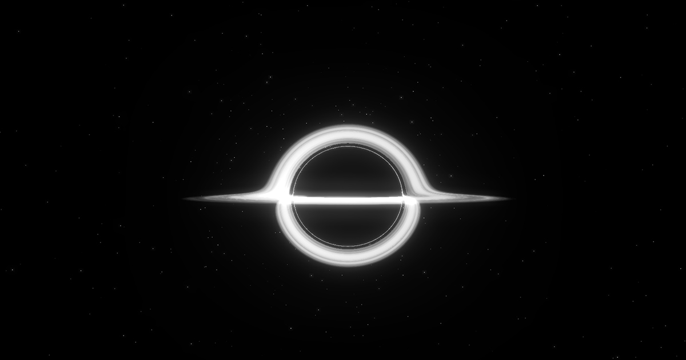

Project L.A.Z.A.R.U.S
=====================

**Lensing Anomalies & Zone Astrophysics for Research on Universal Singularities**

A real-time relativistic visualization platform for exploring gravitational phenomena through physically-based simulations. Features accurate implementations of Schwarzschild black holes and Morris-Thorne wormholes using general relativity equations.

Overview
--------

Project L.A.Z.A.R.U.S bridges theoretical physics and interactive visualization, making complex general relativity concepts accessible through real-time GPU-accelerated simulations. Built for students, educators, and astrophysics enthusiasts.

### Key Features

*   **Schwarzschild Black Hole Simulation**
    *   Real-time geodesic ray tracing in curved spacetime
    *   Temperature-gradient accretion disk (3,000K - 12,000K)
    *   Fractal Brownian Motion turbulence effects
    *   Doppler shift and relativistic beaming
    *   Interactive camera controls with auto-orbit mode
*   **Morris-Thorne Wormhole Visualization**
    *   Three-parameter wormhole metric (ρ, a, M)
    *   Dual rendering modes (geometry + ray-traced)
    *   Einstein ring visualization
    *   Multiple rotation patterns
*   **Educational Resources**
    *   Comprehensive documentation
    *   User guides and controls reference
    *   Shader implementation explanations
    *   Physics theory breakdowns

Tech Stack
----------

*   **Framework:** Next.js 15 (React 18)
*   **3D Graphics:** Three.js with custom GLSL shaders
*   **Physics:** Hamiltonian geodesic integration
*   **Styling:** Tailwind CSS
*   **Animations:** Framer Motion
*   **UI Components:** shadcn/ui
*   **Audio:** React H5 Audio Player
*   **Language:** TypeScript

Getting Started
---------------

### Prerequisites

*   Node.js 18+
*   npm or yarn

### Installation

    # Clone the repository
    git clone https://github.com/berloop/endurance.git
    cd endurance
    
    # Install dependencies
    npm install --legacy-peer-deps
    
    # Run development server
    npm run dev

Open [http://localhost:3000](http://localhost:3000) to view the app.

### Build for Production

    npm run build
    npm start

### Black Hole Parameters

*   **Distance:** Camera distance (7-14 Schwarzschild radii)
*   **Angle:** Horizontal orbital position (0-360°)
*   **Incline:** Vertical viewing angle (-90° to 90°)
*   **FOV:** Field of view (30-90°)
*   **Auto-Orbit:** Automatic camera rotation

### Bloom & Visual Effects

*   **Strength:** Bloom intensity (0-3)
*   **Radius:** Bloom spread (0-1)
*   **Threshold:** Brightness cutoff (0-1)
*   **Disk Temperature:** Accretion disk color (3,000-12,000K)

Physics Implementation
----------------------

### Black Hole Ray Tracing

The simulation solves the geodesic equation in Schwarzschild spacetime using Euler integration. The acceleration term derives from the Schwarzschild metric, where light rays bend according to the curvature of spacetime around the black hole.

### Accretion Disk

*   **Temperature Gradient:** T ∝ r\-3/4 physical law
*   **Doppler Shifting:** Relativistic frequency shifts for rotating matter
*   **Beaming Effects:** Intensity scaling by velocity cubed
*   **FBM Turbulence:** Procedural noise for visual complexity

### Wormhole Metric

Based on the Dneg three-parameter wormhole from Interstellar:

*   ρ (rho): Wormhole radius
*   a: Half-length parameter
*   M: Lensing strength

Audio Credits
-------------

Background music from Hans Zimmer's Interstellar Original Motion Picture Soundtrack:

*   "Day One (Interstellar Theme)"
*   "The Wormhole"
*   "Dust Bowl (Short Film Audio)"
*   Alessandro Roussel - ScienceClic Musique

Scientific References
---------------------

1.  **James, O., von Tunzelmann, E., Franklin, P., & Thorne, K. S.** (2015). "Gravitational lensing by spinning black holes in astrophysics, and in the movie Interstellar". Classical and Quantum Gravity.
2.  **Luminet, J. P.** (1979). "Image of a spherical black hole with thin accretion disk". Astronomy and Astrophysics.
3.  **Thorne, K. S.** (2014). The Science of Interstellar. W. W. Norton & Company.

Support
-------

This project is completely free and open-source. If you find it valuable:

*   ⭐ Star the repository
*   🐛 Report bugs or request features
*   💝 [Support development](https://your-deployment-url.vercel.app/donate)
*   📢 Share with educators and students

License
-------

MIT License - see LICENSE file for details.

Author
------

**Created by Egret**

*   GitHub: [@berloop](https://github.com/berloop)
*   Email: egretfx@gmail.com
*   Project: [github.com/berloop/endurance](https://github.com/berloop/endurance)

* * *

Making general relativity accessible through interactive visualization